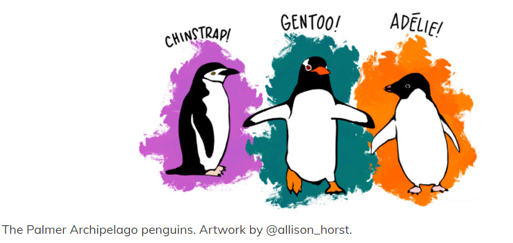

```{r setup, include=FALSE}
options(htmltools.dir.version = FALSE)
knitr::opts_chunk$set(
  fig.width=9, fig.height=3.5, fig.retina=3,
  out.width = "100%",
  cache = FALSE,
  echo = TRUE,
  message = FALSE, 
  warning = FALSE,
  hiline = TRUE
)
```

```{r xaringan-themer, include=FALSE, warning=FALSE}
library(xaringanthemer)
style_duo_accent(
  primary_color = "#006DAE",
  secondary_color = "#EBEBFB",
  inverse_header_color = "#006DAE"
)
```


background-image: url("images/titleimage.png")
background-size: cover


---
class: inverse center middle

# Little bit about myself


---
class: inverse 


## Before 

.left-column[

[**Education**](#3)

[Telethon Kids Institute](#4)

]

.right-column[

#### Undergraduate degree
B.Tech in Electrical and Electronics Engineering<br/>
Amrita School of Engineering <br/>
Kerala,India


#### Post graduate degree
Master of Business Analytics<br/>
Monash University <br/>
Melbourne, Australia
]

---
class: inverse 

## After 


.left-column[

[Education](#3)

[**Telethon Kids Institute**](#4)
]

.right-column[

#### About Telethon Kids Institute
The Telethon Kids Institute is based within the Perth Children’s Hospital, and is one of the largest medical research institutes in Australia dedicated to improve the health and wellbeing of children.<br/>


#### Infectious Disease Modeller

Develop statistical and mathematical analyses of COVID-19 transmission in Australia.


]


---
class: inverse bold-last-item


## So what are we doing here ?!

- Data science allows you to turn raw data into knowledge, understanding, and insight.

- To give you a very brief intro into how you can analyse data and gather some insights from it using R. 

- A walk through some exploratory data analysis on a lovely penguins dataset. This is data about penguins collected by Dr. Kristen Gorman and the Palmer Station in Antarctica. Allison Horst put it into a R package called palmerpenguins.

---
class: inverse center middle

## To help you through all your questions during the lecture, I invited Mr. Aryan Jain, a fellow data scientist from my alma mater. 

<center></center>

Feel free to chuck in all your questions in the chat ! 

---
class: inverse bold-last-item

### Why R? 

1. Because it is FREE! 
--

1. Powerful: Over 15000 contributed packages on the main repository (CRAN), as of March 2020, provided by top international researchers and programmers.
--

1. Flexible: It is a language, and thus allows you to create your own solutions
--

1. Community: Large global community friendly and helpful, lots of resources 


---
class: inverse bold-last-item
## That brings us to RStudio !

- R is a statistical programming language

- RStudio is a convenient interface for R (an integrated
development environment, IDE)

> **"If R were an airplane, RStudio would be the airport, providing many, many supporting services that make it easier for you, the
pilot, to take off and go to awesome places. Sure, you can fly an
airplane without an airport, but having those runways and
supporting infrastructure is a game-changer."
<br>
Julie Lowndes**

---
class: inverse 
## Here is what a typical data science project looks like !

<center></center>


- **Import your data into R** : Take data stored in a file, database, or web application programming interface (API), and load it into a data frame in R.

- **Tidy the data** : To structure the data, you MUST tidy it. Makes arriving at your research questions so much easier. Three rules makes a dataset tidy: 
    + variables are in columns
    + observations are in rows
    + values are in cells

---
class: inverse 

- **Transform** : Transformation includes narrowing in on observations of interest. 
For example: 
  + Creating new variables that are functions of existing variables (like computing speed from distance and time)
  + Calculating a set of summary statistics (like counts or means). 
  
**Tidy + Transform = Data Wrangling**

##### Two main engines of knowledge generation: visualisation and modelling!

- **Visualisation** : A good visualisation will show you things that you did not expect, or raise new questions about the data.

- **Models** : Once you have made your questions sufficiently precise, you can use a model to answer them. The goal of a model is to provide a simple low-dimensional summary of a dataset. You can use models to partition data into patterns and noise.

- **Communication** : Absolutely critical! It doesn’t matter how well your models and visualisation have led you to understand the data unless you can also communicate your results to others.

  + This is where R Markdown could help! 
  
```{r echo=TRUE,eval=FALSE}
install.packages("rmarkdown")
```
  

---
class: inverse 
 
## Lets do some exploring!

The `palmerpenguins` data contains size measurements for three penguin species observed on three islands in the Palmer Archipelago, Antarctica.

```{r echo=TRUE,eval=FALSE}

install.packages("palmerpenguins")

```

<center></center>


---
class: inverse center middle

### Live Demo 

- You can find the R Markdown file with codes [here](https://github.com/aarathybabu97/intro-data-analysis-workshop/blob/main/students_copy.Rmd)
- Use the link [here](https://rpubs.com/aarathybabu/ida-techtalk-amrita) to check out the reference file. 

---

class: inverse 

# References

- Resources : R for Data Science by Hadley Wickham

- Slides created via the R packages:

  + [**xaringan**](https://github.com/yihui/xaringan)<br>
  + [gadenbuie/xaringanthemer](https://github.com/gadenbuie/xaringanthemer)
  
---
class: inverse center middle

# Thank you!